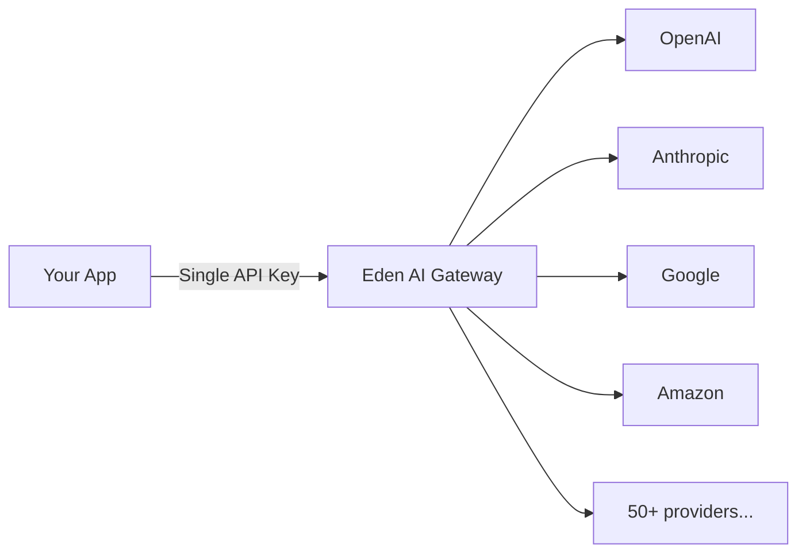

Eden AI is a **unified AI gateway** that gives you access to **200+ AI models** from 50+ providers through a single API. Instead of integrating each AI provider separately, you connect once to Eden AI and get instant access to the entire AI ecosystem.



## Two Endpoints, Full Coverage

Eden AI V3 organizes all AI capabilities under two main endpoints:

| Endpoint | Purpose | Model Format |
| --- | --- | --- |
| `POST /v3/llm/chat/completions` | LLMs (chat, text generation, vision, tool calling) | `provider/model` |
| `POST /v3/universal-ai` | Expert models (OCR, text analysis, image, translation, audio) | `feature/subfeature/provider[/model]` |

Both endpoints share the same base URL and authentication.

## Base URL

```
https://api.edenai.run/v3
```

## Authentication

All requests require a Bearer token in the `Authorization` header:

```
Authorization: Bearer YOUR_API_KEY
```

Get your API key from the [Eden AI dashboard](https://app.edenai.run/).

## Key Benefits

<CardGroup cols={2}>

<Card title="Single Integration" icon="plug">
  Connect once to Eden AI and access every supported AI provider. No need to manage separate SDKs or API keys for each provider.
</Card>

<Card title="Unified Billing" icon="receipt">
  One invoice for all your AI usage. Every API response includes a `cost` field in USD so you always know exactly what you spent.
</Card>

<Card title="OpenAI-Compatible Format" icon="code">
  The LLM endpoint follows the OpenAI chat completions format. Use any OpenAI-compatible SDK or tool and just change the base URL.
</Card>

<Card title="Multi-Provider Support" icon="layer-group">
  Switch between providers by changing a single string in your request. No code changes needed.
</Card>

<Card title="Persistent File Storage" icon="hard-drive">
  Upload files once and reference them by UUID across multiple requests and features.
</Card>

<Card title="Built-in API Discovery" icon="compass">
  Explore available models, features, and input schemas programmatically through the listing endpoints.
</Card>

</CardGroup>

## Pay-Per-Use Pricing

Eden AI uses a **pay-per-use** model. You only pay for the API calls you make. Every response includes a `cost` field showing the exact charge in USD:

```json
{
  "status": "success",
  "cost": 0.0015,
  "output": { ... }
}
```

No minimum commitments, no upfront fees. See [Plans & Pricing](/v3/overview/plans-prices) for details on available tiers.

## Quick Example

<CodeGroup>
```python Python
import requests

# LLM call
response = requests.post(
    "https://api.edenai.run/v3/llm/chat/completions",
    headers={
        "Authorization": "Bearer YOUR_API_KEY",
        "Content-Type": "application/json"
    },
    json={
        "model": "openai/gpt-4",
        "messages": [{"role": "user", "content": "Hello!"}]
    }
)
print(response.json()["choices"][0]["message"]["content"])
```

```bash cURL
curl -X POST https://api.edenai.run/v3/llm/chat/completions \
  -H "Authorization: Bearer YOUR_API_KEY" \
  -H "Content-Type: application/json" \
  -d '{
    "model": "openai/gpt-4",
    "messages": [{"role": "user", "content": "Hello!"}]
  }'
```

```javascript JavaScript
const response = await fetch('https://api.edenai.run/v3/llm/chat/completions', {
  method: 'POST',
  headers: {
    'Authorization': 'Bearer YOUR_API_KEY',
    'Content-Type': 'application/json'
  },
  body: JSON.stringify({
    model: 'openai/gpt-4',
    messages: [{role: 'user', content: 'Hello!'}]
  })
});

const result = await response.json();
console.log(result.choices[0].message.content);
```
</CodeGroup>

<Note>
If you were a user before January 2026, you still have access to the previous version at [old-app.edenai.run](https://old-app.edenai.run/). The old version will continue to be supported until the end of 2026. Documentation for the previous version is available at [old-docs.edenai.co](https://old-docs.edenai.co).
</Note>

## Next Steps

<CardGroup cols={2}>

<Card title="Make Your First LLM Call" icon="message" href="/v3/quickstart/first-llm-call">
  Send a chat completion request in under a minute.
</Card>

<Card title="Make Your First Universal AI Call" icon="wand-magic-sparkles" href="/v3/quickstart/first-universal-ai-call">
  Try OCR, text analysis, or image generation with a single endpoint.
</Card>

<Card title="LLMs vs Expert Models" icon="scale-balanced" href="/v3/overview/llms-vs-expert-models">
  Understand which endpoint to use for your use case.
</Card>

<Card title="Plans & Pricing" icon="credit-card" href="/v3/overview/plans-prices">
  Explore available plans and pricing tiers.
</Card>

</CardGroup>
