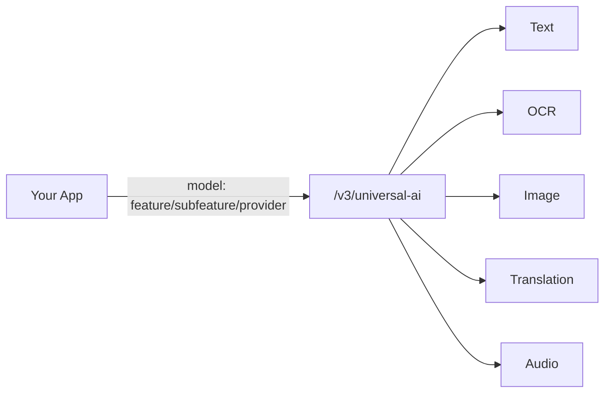

Universal AI is Eden AI's **single endpoint for all non-LLM AI features**. Instead of calling different endpoints for different tasks, you send every request to one URL and use a **model string** to specify what you need.

```
POST /v3/universal-ai
```



One endpoint for text analysis, OCR, image processing, translation, and audio.

## Model String Format

The model string tells the endpoint which feature, provider, and optionally which specific model to use:

```
feature/subfeature/provider[/model]
```

**Examples:**

| Model String | What It Does |
| --- | --- |
| `text/moderation/google` | Moderate text with Google |
| `text/moderation/openai` | Moderate text with OpenAI |
| `ocr/financial_parser/google` | Parse invoices/receipts with Google |
| `image/generation/openai/dall-e-3` | Generate images with DALL-E 3 |
| `translation/document_translation/deepl` | Translate documents with DeepL |

The `/model` segment is optional. When omitted, the provider's default model is used.

## Basic Request

<CodeGroup>
```python Python
import requests

url = "https://api.edenai.run/v3/universal-ai"
headers = {
    "Authorization": "Bearer YOUR_API_KEY",
    "Content-Type": "application/json"
}

payload = {
    "model": "text/moderation/openai",
    "input": {
        "text": "This is sample text to moderate"
    }
}

response = requests.post(url, headers=headers, json=payload)
result = response.json()
print(result)
```

```bash cURL
curl -X POST https://api.edenai.run/v3/universal-ai \
  -H "Authorization: Bearer YOUR_API_KEY" \
  -H "Content-Type: application/json" \
  -d '{
    "model": "text/moderation/openai",
    "input": {
      "text": "This is sample text to moderate"
    }
  }'
```

```javascript JavaScript
const response = await fetch('https://api.edenai.run/v3/universal-ai', {
  method: 'POST',
  headers: {
    'Authorization': 'Bearer YOUR_API_KEY',
    'Content-Type': 'application/json'
  },
  body: JSON.stringify({
    model: 'text/moderation/openai',
    input: { text: 'This is sample text to moderate' }
  })
});

const result = await response.json();
console.log(result);
```
</CodeGroup>

## Response Format

Every Universal AI response follows the same structure:

```json
{
  "status": "success",
  "cost": 0.0001,
  "provider": "openai",
  "feature": "text",
  "subfeature": "moderation",
  "output": {
    // Feature-specific output
  }
}
```

| Field | Description |
| --- | --- |
| `status` | `"success"` or `"error"` |
| `cost` | Charge for this request in USD |
| `provider` | The provider that handled the request |
| `feature` | Top-level feature category |
| `subfeature` | Specific capability used |
| `output` | Feature-specific results |

## Input Formats

The `input` field varies depending on the feature type.

### Text-Based Input

For text analysis features (moderation, AI detection, NER, etc.):

```json
{
  "model": "text/moderation/google",
  "input": {
    "text": "Text to analyze"
  }
}
```

### File UUID Input

Upload a file first with `/v3/upload`, then reference it by UUID:

```json
{
  "model": "ocr/financial_parser/google",
  "input": {
    "file": "550e8400-e29b-41d4-a716-446655440000"
  }
}
```

### File URL Input

Pass a publicly accessible URL directly:

```json
{
  "model": "image/object_detection/google",
  "input": {
    "file": "https://example.com/image.jpg"
  }
}
```

<Tip>
For files you need to use more than once, upload them via `/v3/upload` first. Uploaded files are stored for 7 days and can be referenced across multiple requests.
</Tip>

## Available Features

| Category | Features | Example Model Strings |
| --- | --- | --- |
| **Text** | Moderation, AI detection, NER, sentiment, spell check, topic extraction | `text/moderation/openai`, `text/ai_detection/sapling` |
| **OCR** | Text extraction, invoice parsing, ID parsing, resume parsing, table extraction | `ocr/financial_parser/google`, `ocr/identity_parser/amazon` |
| **Image** | Generation, object detection, face detection, explicit content, background removal, logo detection | `image/generation/openai/dall-e-3`, `image/object_detection/google` |
| **Translation** | Document translation | `translation/document_translation/deepl` |
| **Audio** | Speech-to-text, text-to-speech | `audio/speech_to_text_async/google`, `audio/text_to_speech/amazon` |

<Info>
Use the [listing models endpoint](/v3/llms/listing-models) to discover all available features, providers, and models programmatically.
</Info>

## Next Steps

<CardGroup cols={2}>

<Card title="Text Features" icon="font" href="/v3/expert-models/text-features">
  Text moderation, AI detection, NER, and more.
</Card>

<Card title="OCR Features" icon="file-lines" href="/v3/expert-models/ocr-features">
  Document parsing, text extraction, and table recognition.
</Card>

<Card title="Image Features" icon="image" href="/v3/expert-models/image-features">
  Image generation, detection, and analysis.
</Card>

<Card title="Listing Models" icon="list" href="/v3/llms/listing-models">
  Discover available models and features programmatically.
</Card>

</CardGroup>
